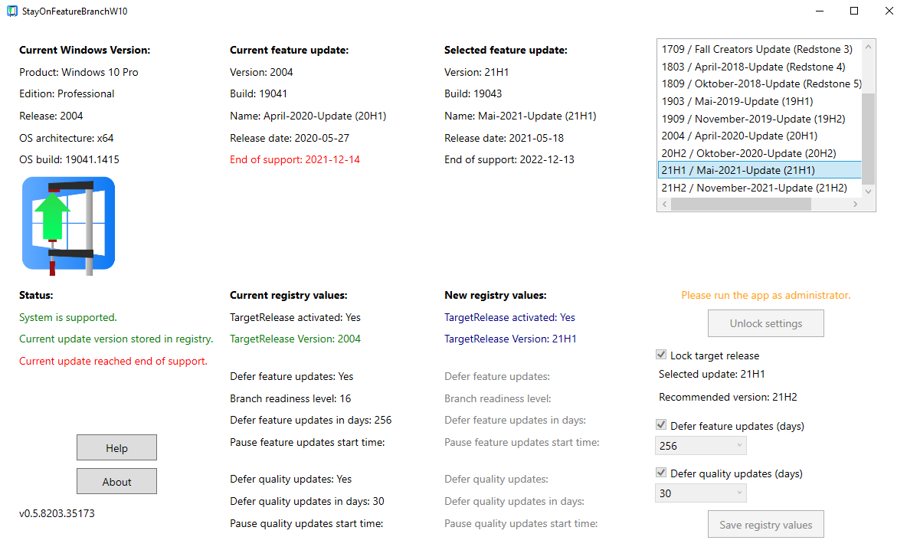
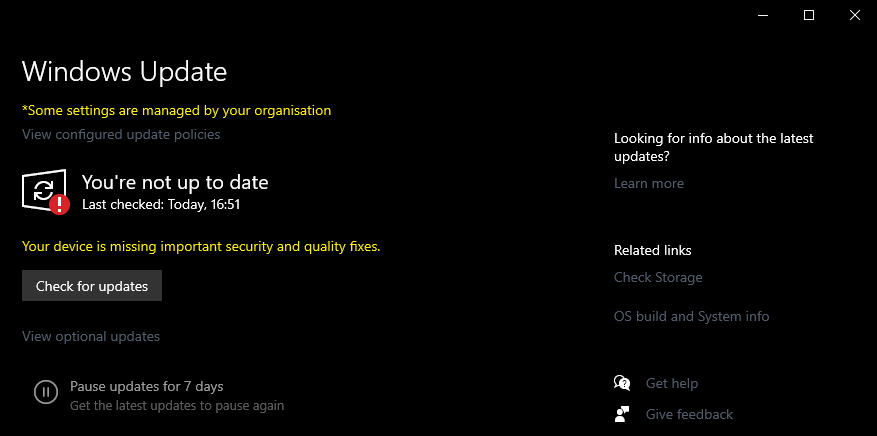

# StayOnFeatureBranchW10
 Set your preferred windows 10 version/update in registry and defer feature updates.

Description:
- Allows to stay on a Windows 10 target release by setting the version in registry
- Option to defer installation of feature updates for up to 365 days and quality updates up to 30 days

Requirements:
- Windows 10 Professional x64 bit

Validation:
- Check if you windows update panel shows "Some settings are managed by your organisation"

Install:
- Download the current app release and unzip the file
- Launch the app by clicking "StayOnFeatureBranchW10.exe" or perform a right click and "Run as administrator" to change registry values
- Select the values in the app and use the check boxes to mark a setting for a registry update. Finally click on "Save registry values"

Uninstall:
- Launch the app and uncheck all 3 check boxes. Save the changes by clicking "Save registry values"
- Remove folder containing the app
